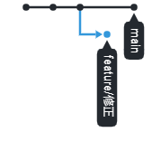

<<<<<<< HEAD
このブランチはmainブランチです
=======
このブランチはfeature/修正 ブランチです
>>>>>>> 840cbae3f83a758974c289baf4071b9fbf16de7a
# コンフリクトの解消
コンピュータ概論II の課題です。

このリポジトリには、mainブランチと、feature/修正 ブランチが用意されています。

このリポジトリをforkした後、あなたのmainブランチをfeature/修正 ブランチと同じ状態にした後、
あなたのmainブランチから、この（tpu-game-2022/comp2_2_branchの）mainブランチにプルリクエストを出してください。

# 進め方
* 本リポジトリをforkしてください
* リポジトリをローカルにダウンロードしてください
* mainブランチにfeature/修正ブランチをマージしてください
  * mainブランチをfeature/修正ブランチの内容にしてください
* 更新内容をコミットしてください
* コミットした結果をGitHubにプッシュしてください
* 本リポジトリにプルリクエストをしてください
